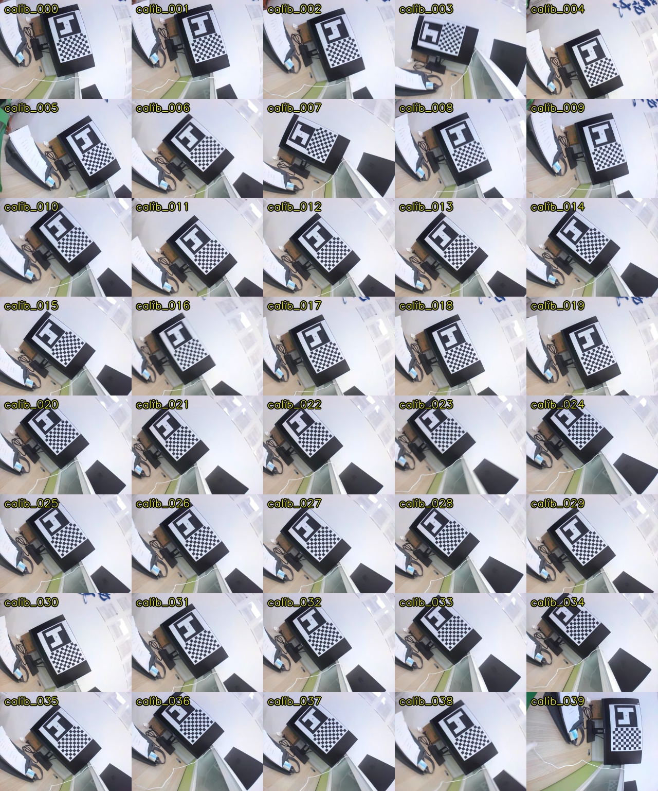
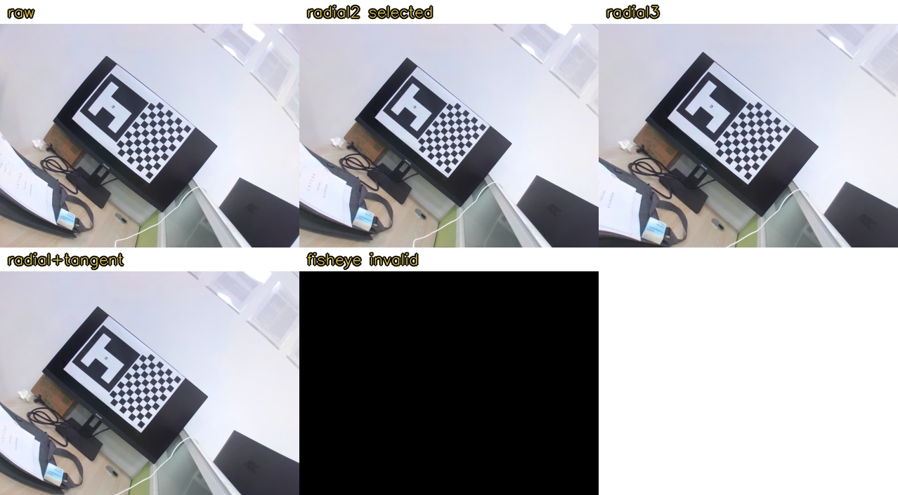
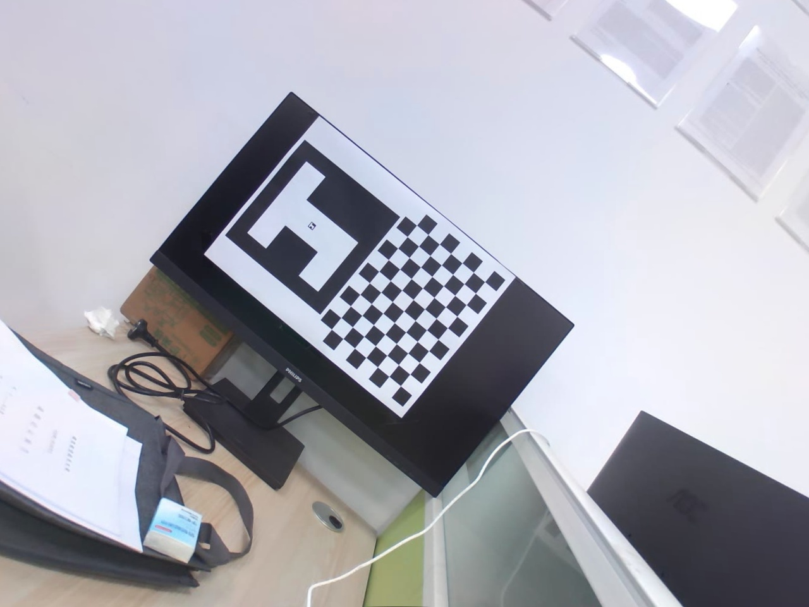
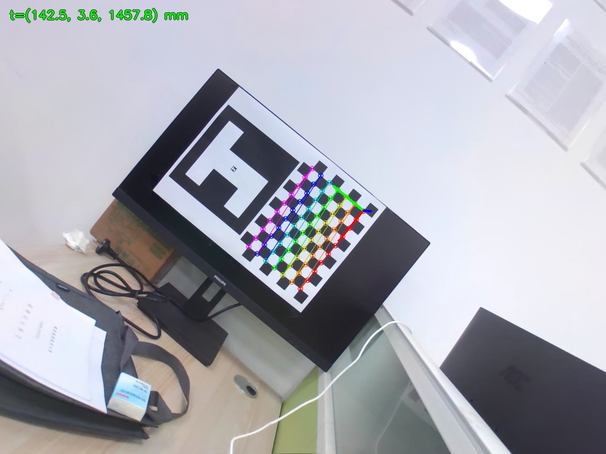

# RK3588 相机标定、全局去畸变与棋盘格位姿计算实验报告

## 一、实验概述

本实验在 RK3588 板卡上调用 `camera0` 相机，使用显示器上的 H 标志与 `10 x 7` 内角点棋盘格完成相机标定、全局去畸变和棋盘格位姿计算。棋盘格单格边长为 `24 mm`。

本次实验按以下流程执行：实时预览并录制视频，从视频抽取 40 张清晰且姿态不同的标定图，比较多种相机模型，计算原始内参、畸变系数和全局去畸变后的新内参矩阵，再使用棋盘格计算相机位姿，并在 40 张图上回放验证。

实验日期为 `2026-07-13`。所有正式结果保存在 `data` 目录，过程日志保存在 `data/process_log.md`。

## 二、设备与参数

| 项目 | 配置 |
|---|---|
| 计算平台 | RK3588 板卡 |
| 相机位置 | `camera0` |
| 视频设备 | `/dev/video11` |
| 采集方式 | OpenCV + GStreamer/V4L2 |
| 相机原始分辨率 | `3264 × 2448` |
| 图像分辨率 | `1280 x 960` |
| 视频编码 | MJPG/AVI |
| 棋盘格规格 | `10 x 7` 个内角点，共 70 点 |
| 棋盘格单格边长 | `24 mm` |
| 标定图数量 | 40 张 |
| 位姿测试图 | `data/calibration_images/calib_015.jpg` |
| 原始视频 | `data/calibration_source.avi` |

相机坐标系采用 OpenCV 约定：X 轴向图像右侧，Y 轴向图像下方，Z 轴沿相机光轴向前。棋盘平面定义为 `Z=0`，相邻内角点的三维间距为 `24 mm`。

棋盘坐标系由最终排序后的 `10 x 7` 内角点确定。排序后的第一个角点作为棋盘坐标原点 `O_board=(0,0,0)`；同一行角点序号递增方向定义为棋盘 X 轴正方向；同一列角点序号递增方向定义为棋盘 Y 轴正方向；Z 轴由右手系确定，垂直于棋盘平面。三维点按以下方式生成：

```text
P_board(col, row) = (col * 24, row * 24, 0) mm
col = 0..9, row = 0..6
```

由于规则棋盘旋转 180 度后外观仍可能成立，角点检测得到的初始顺序不能直接作为坐标系方向。实验中使用 H 外形与棋盘的固定相对位置对正向和反向两种角点顺序评分，选定最终角点顺序后再建立上述棋盘坐标系。因此，H 不参与毫米尺度 PnP 求解，但参与棋盘坐标系正方向的确定。

位姿可视化中的坐标轴颜色对应关系为：红色表示棋盘坐标系 `+X` 轴，绿色表示棋盘坐标系 `+Y` 轴，蓝色表示棋盘坐标系 `-Z` 轴。蓝色画为 `-Z` 是为了让垂直棋盘平面的方向在图像中更直观地表现为从靶标平面朝相机方向伸出；数学计算中的棋盘坐标系仍按右手系定义。

位姿满足：

```text
X_camera = R * X_board + t
```

其中 `tvec` 表示棋盘坐标系原点在相机坐标系中的位置；相机光心在棋盘坐标系中的位置为：

```text
C_board = -R^T * t
```

## 三、实验流程

完整流程如下：

```text
相机节点确认
  -> 实时预览并等待人工开始
  -> 手动移动相机录制视频
  -> 从视频抽取候选帧
  -> 按完整角点、清晰度和姿态差异筛选 40 张图
  -> 标定前质量检查
  -> 多模型拟合与交叉验证
  -> 选择最终模型并计算 K、D、K_new
  -> 全图去畸变和视觉检查
  -> H 辅助棋盘方向判定
  -> IPPE + LM 位姿求解
  -> 40 张图回放验证
```

本次不使用局部 ROI 去畸变，也不使用平面单应性把目标区域拉正。相机移动后，画面任意位置都使用同一套全局 `K`、`D` 和 `K_new`。

## 四、视频录制

### 4.1 录制命令

```bash
python3 -m camera_pose record-video \
  --device /dev/video11 \
  --width 1280 --height 960 --fps 30 \
  --wait-for-start \
  --preview-port 8080 \
  --preview-image data/live_preview.jpg \
  --output data/calibration_source.avi
```

程序启动后先实时预览，不立即录制。确认画面和清晰度后，由人工按回车开始录制；结束时按 `Ctrl+C`，程序释放视频写入器并保存 AVI 文件。预览画面显示棋盘检测状态和 Laplacian 清晰度，便于移动镜头时控制速度和画面质量。

### 4.2 录制结果

| 项目 | 结果 |
|---|---:|
| 输出文件 | `data/calibration_source.avi` |
| 图像分辨率 | `1280 x 960` |
| 视频帧数 | 838 帧 |
| 容器标称帧率 | `30 FPS` |
| 容器显示时长 | `27.933 s` |
| 实际录制墙钟时长 | 约 `99.8 s` |

需要说明的是，本项目保留相机实际采集到的帧，不为了让播放器时长等于墙钟时间而补重复帧。因此 AVI 容器按 `30 FPS` 播放时会比真实移动过程更快。这不影响标定，因为抽帧和标定使用的是实际图像内容，而不是播放器时间长度。

## 五、抽帧与标定集

### 5.1 抽帧命令

```bash
python3 -m camera_pose extract-frames \
  --video data/calibration_source.avi \
  --pattern 10 7 \
  --max-images 40 \
  --min-sharpness 500 \
  --min-corner-shift 24 \
  --sample-interval 0.25 \
  --output data/calibration_images
```

筛选规则如下：

1. 必须检测到完整 `10 x 7` 棋盘内角点。
2. 棋盘区域 Laplacian 清晰度必须不低于 `500`。
3. 与已选图像相比，角点几何位置需有足够差异，减少重复姿态。
4. 在全视频候选帧中按角点几何差异和清晰度联合选择 40 张图。

### 5.2 抽帧结果

| 指标 | 结果 |
|---|---:|
| 清晰候选帧 | 79 张 |
| 最终标定图 | 40 张 |
| 源视频帧范围 | 第 24 帧至第 832 帧 |
| 最低抽帧清晰度 | `559.7399` |
| 最高抽帧清晰度 | `1749.4930` |

抽帧记录保存在 `data/extracted_frames.yaml`。



实际查看接触表后确认：40 张图中的棋盘和 H 均完整可见，没有被相机支架或线缆遮挡，且包含不同位置、距离和旋转角度。

## 六、标定前质量检查

标定前质量检查命令：

```bash
python3 -m camera_pose quality \
  --pattern 10 7 \
  --images data/calibration_images \
  --square-size 24 \
  --output data/quality_before_calibration.yaml
```

结果如下：

| 指标 | 结果 |
|---|---:|
| 图像总数 | 40 |
| 完整棋盘检测成功 | `40/40` |
| 最低清晰度 | `557.9722` |
| 最高清晰度 | `1772.8813` |
| 平均清晰度 | `1085.7873` |

全部图像均可检测到完整 70 个棋盘角点，因此进入标定阶段。

## 七、模型比较与选择

### 7.1 候选模型

本实验比较四种模型：

| 模型 | 自由畸变参数 | 说明 |
|---|---:|---|
| `pinhole_radial2` | 2 | 两参数径向针孔模型，固定 `p1=p2=k3=0` |
| `pinhole_radial3` | 3 | 三参数径向针孔模型，固定 `p1=p2=0` |
| `pinhole_tangent3` | 5 | 径向与切向畸变联合模型 |
| `fisheye` | 4 | OpenCV 鱼眼模型 |

评价指标包括：全量 RMS 重投影误差、3 折留出误差、全图去畸变后无效像素比例、原始视场采样保留比例、棋盘直线残差，以及实际输出图像外观。

### 7.2 全局去畸变约束

采用全局去畸变，`K_new` 的计算策略为：

1. 输出尺寸保持 `1280 x 960`。
2. 新内参矩阵强制 `fx_new = fy_new`，保持方形像素。
3. 搜索满足零无效输出像素的最小焦距，避免顶部黑弧或边缘黑洞。
4. 模型选择要求原始视场采样保留比例不低于 `89.5%`。

 `alpha=0` 不是“去畸变强度”，只是新虚拟相机视场选择策略。真正的去畸变量由标定得到的 `K` 和 `D` 决定。

### 7.3 模型比较结果

| 模型 | 参数数 | 全量 RMS/px | 3 折留出均值/px | 原视场采样保留 | 无效输出像素 | 棋盘归一化直线残差 |
|---|---:|---:|---:|---:|---:|---:|
| 两参数径向针孔 | 2 | `0.234098` | `0.201449` | `89.58%` | `0` | `0.002391` |
| 三参数径向针孔 | 3 | `0.233643` | `0.202227` | `79.86%` | `0` | `0.002388` |
| 带切向项针孔 | 5 | `0.197939` | `0.166401` | `86.38%` | `0` | `0.002314` |
| 鱼眼 | 4 | `0.233599` | `0.199844` | `0%` | `100%` | 无效 |

带切向项模型的误差最低，但它的原始视场采样保留比例只有 `86.38%`，低于全局移动场景的门槛。三参数径向模型的误差提升很小，同时视场保留下降到 `79.86%`。鱼眼模型在本数据上全图映射失效。最终只有两参数径向针孔模型同时满足全图有效、视场保留和稳定性要求，因此选为最终模型：

```text
model = pinhole_radial2
```



实际查看模型对比图后确认：最终两参数模型没有内部黑洞、顶部黑弧或异常拉伸；复杂模型虽然局部误差略低，但全局视场代价更大。

## 八、相机标定结果

标定命令：

```bash
python3 -m camera_pose calibrate \
  --pattern 10 7 \
  --square-size 24 \
  --images data/calibration_images \
  --output data/calibration.yaml \
  --evaluation-output data/calibration_model_evaluation.yaml \
  --min-images 40 \
  --cv-folds 3 \
  --undistort-alpha 0
```

最终联合标定 RMS 重投影误差为：

```text
RMS = 0.2340977408 px
```

原始内参矩阵：

```text
K =
[1572.473515,    0.000000, 631.009383]
[   0.000000, 1569.155259, 449.135933]
[   0.000000,    0.000000,   1.000000]
```

畸变系数：

```text
D = [k1, k2, p1, p2, k3]
  = [-0.9588509072, 1.2409265029, 0, 0, 0]
```

其中 `p1`、`p2` 和 `k3` 按模型定义固定为 0。

## 九、全局去畸变结果

### 9.1 新内参矩阵

去畸变输出图像仍为 `1280 x 960`，使用的新内参矩阵为：

```text
K_new =
[1421.543446,    0.000000, 628.133651]
[   0.000000, 1421.543446, 442.413497]
[   0.000000,    0.000000,   1.000000]

D_new = [0, 0, 0, 0, 0]
```

使用去畸变后的图像或去畸变后的角点计算位姿时，必须使用 `K_new` 和零畸变系数，不能继续使用原始 `K` 和 `D`。

### 9.2 全图映射质量

| 指标 | 结果 |
|---|---:|
| 输出尺寸 | `1280 x 960` |
| 无效输出像素比例 | `0` |
| 有限数值映射比例 | `100%` |
| 原始视场采样保留比例 | `89.5777%` |
| 全图有效矩形 | `[0, 0, 1279, 959]` |

这表示最终图像没有黑弧、黑洞或无效边界像素。约 `10.42%` 的极边缘原始视场被舍弃，这是为了在全局去畸变结果中保持完整有效画面而付出的固定视场代价。

### 9.3 棋盘直线残差

直线残差的计算方式为：对每一行和每一列角点拟合直线，计算角点到对应直线的距离，并用相邻角点间距归一化。

全部 40 张图的平均结果：

```text
原图归一化平均直线残差       = 0.005914 个格长
去畸变后归一化平均直线残差   = 0.002391 个格长
下降比例                     = 59.57%
```

在最终测试图 `calib_015.jpg` 上：

```text
原图平均直线残差             = 0.078232 px
去畸变后平均直线残差         = 0.034845 px
原图归一化平均残差           = 0.003031 个格长
去畸变后归一化平均残差       = 0.001482 个格长
```

去畸变命令：

```bash
python3 -m camera_pose undistort-image \
  --input data/calibration_images/calib_015.jpg \
  --calibration data/calibration.yaml \
  --pattern 10 7 \
  --output data/undistorted_full.jpg \
  --metrics-output data/undistortion_quality.yaml
```



实际查看最终图后确认：棋盘和 H 完整保留，画面无黑弧、无内部黑洞，棋盘行列比原图更直。显示器或桌面边缘仍可能因透视关系显得倾斜或弯曲，定量评价以棋盘这种已知平面直线阵列为准。

## 十、标定后质量检查

使用最终参数重新检查 40 张图：

```bash
python3 -m camera_pose quality \
  --pattern 10 7 \
  --images data/calibration_images \
  --square-size 24 \
  --calibration data/calibration.yaml \
  --output data/quality_report.yaml
```

| 指标 | 结果 |
|---|---:|
| 逐图平均误差的均值 | `0.194263 px` |
| 最差单图平均误差 | `0.347700 px` |
| 最差单点误差 | `1.248381 px` |

整体误差处于亚像素范围。最大单点误差只出现在个别角点，不代表整张图的位姿失稳。

## 十一、H 辅助方向判定与位姿算法

本次 H 图像只用于棋盘方向消歧，不参与毫米尺度 PnP 求解。原因如下：

1. 规则棋盘旋转 180 度后外观相同，角点顺序可能出现方向歧义。
2. H 外形与棋盘相对位置固定，可用于选择正确角点顺序。
3. H 标志的物理尺寸和坐标系已单独定义，但当前棋盘格位姿仍作为毫米尺度 PnP 的基准数据源。
4. 棋盘 70 个角点具有已知 `24 mm` 间距和亚像素定位能力，更适合作为位姿主数据源。

### 11.1 H 坐标系与棋盘格坐标系的关系

H 坐标系原点定义为 H 标志几何中心。H 原点在棋盘格坐标系中的位置为：

```text
p_board_H = (18.5, 27.0, 0.0) mm
```

H 标志与棋盘格位于同一平面，因此 `z=0`。两套坐标系的轴方向定义为：

```text
+X_H = -Y_board
+Y_H = -X_board
+Z_H = -Z_board
```

因此，从 H 坐标系向棋盘格坐标系的旋转矩阵为：

```text
R_board_H =
[[ 0, -1,  0],
 [-1,  0,  0],
 [ 0,  0, -1]]
```

该矩阵满足右手坐标系关系：`(+X_H) × (+Y_H) = +Z_H`。

点坐标转换为：

```text
p_board = R_board_H * p_H + p_board_H
```

棋盘格位姿使用以下定义：

```text
X_camera = R_camera_board * X_board + t_camera_board
```

转换为 H 坐标系后：

```text
R_camera_H = R_camera_board * R_board_H
t_camera_H = R_camera_board * p_board_H + t_camera_board
```

### 11.2 当前测试图的 H 基准位姿

在 `data/calibration_images/calib_015.jpg` 上，棋盘格位姿转换到 H 坐标系后得到：

```text
R_camera_H =
[[ 0.769431749155,  0.632225026543,  0.090919190522],
 [ 0.634440757918, -0.772950355262,  0.005716029462],
 [ 0.073889837493,  0.053284745598, -0.995841868874]]

t_camera_H =
[109.989360, 0.773349, 1454.810189] mm
```

这里的 `t_camera_H` 表示 H 坐标系原点在相机坐标系中的位置。后续 H 检测得到的位姿应统一转换到同一坐标系后，再与上述棋盘格基准位姿进行比较。

位姿计算步骤：

1. 在原始图像中检测棋盘角点。
2. 使用 H 外形判断角点顺序是否需要反转。
3. 将原始角点映射到全局去畸变坐标系。
4. 使用 `K_new` 和 `D_new=0` 计算位姿。
5. 使用 IPPE 求解平面 PnP 双解，并按重投影误差选优。
6. 使用 LM 方法精化 `rvec` 和 `tvec`。
7. 在全局去畸变图上绘制角点和坐标轴。

## 十二、最终位姿结果

最终测试图为 `data/calibration_images/calib_015.jpg`，该图清晰、无遮挡，棋盘和 H 均完整。

执行命令：

```bash
python3 -m camera_pose pose-image \
  --input data/calibration_images/calib_015.jpg \
  --calibration data/calibration.yaml \
  --pattern 10 7 \
  --square-size 24 \
  --output data/pose_latest.yaml \
  --image-output data/pose_latest.jpg \
  --undistorted-output data/undistorted_full.jpg
```

### 12.1 H 方向判定

```text
正向匹配分数     = 0.938788
反向匹配分数     = 0.510213
置信差            = 0.428576
方向判定          = 成功
```

### 12.2 平移结果

棋盘坐标系到相机坐标系的平移向量：

```text
tvec = [142.4602, 3.6037, 1457.7910] mm
```

相机光心在棋盘坐标系中的位置：

```text
C_board = [164.9595, 219.6156, -1438.7563] mm
```

### 12.3 位姿重投影误差

```text
平均误差                 = 0.136189 px
95% 分位误差             = 0.251746 px
最大误差                 = 0.387901 px
IPPE 第二候选解平均误差  = 0.464156 px
```

最终解的平均误差显著小于 IPPE 第二候选解，说明该图上的平面位姿解稳定。



## 十三、40 张图回放验证

为避免只根据单张展示图下结论，本实验使用同一组 `K`、`D` 和 `K_new` 对全部 40 张标定图回放位姿算法。结果保存在 `data/pose_validation.yaml`。

| 指标 | 结果 |
|---|---:|
| 输入图像 | 40 张 |
| 棋盘检测成功 | `40/40` |
| 位姿计算成功 | `40/40` |
| H 方向判定成功 | `40/40` |
| 平均位姿重投影误差 | `0.180586 px` |
| 最差单图平均误差 | `0.321660 px` |
| 最差单点误差 | `1.186932 px` |

回放结果说明：在本次视频覆盖的移动范围内，最终标定参数、全局去畸变和棋盘格位姿算法可以稳定工作。

## 十四、输出文件

| 文件 | 内容 |
|---|---|
| `data/calibration_source.avi` | 正式标定视频，也可作为后续目标检测数据源 |
| `data/calibration_images/` | 最终 40 张标定图 |
| `data/calibration_contact_sheet.jpg` | 40 张标定图视觉总览 |
| `data/extracted_frames.yaml` | 抽帧候选和最终选择记录 |
| `data/quality_before_calibration.yaml` | 标定前质量检查 |
| `data/calibration.yaml` | 最终 `K`、`D`、`K_new` 和全局映射参数 |
| `data/calibration_model_evaluation.yaml` | 候选模型比较 |
| `data/global_undistortion_comparison.jpg` | 候选模型视觉对比 |
| `data/quality_report.yaml` | 标定后逐图误差 |
| `data/undistorted_full.jpg` | 最终全局去畸变图 |
| `data/undistortion_quality.yaml` | 去畸变直线残差评价 |
| `data/pose_latest.yaml` | 最终测试图位姿 |
| `data/pose_latest.jpg` | 最终位姿叠加图 |
| `data/pose_validation.yaml` | 40 张图位姿回放验证 |
| `data/process_log.md` | 实验过程日志 |

## 十五、实验结论

1. 本次使用 `1280 x 960` 分辨率重新录制视频，并从全视频中抽取 40 张清晰、完整且姿态分散的标定图。
2. 40 张图全部通过棋盘检测，最低清晰度为 `557.9722`，平均清晰度为 `1085.7873`。
3. 多模型比较后，最终选择两参数径向针孔模型。虽然带切向项模型误差更低，但全局视场保留不足，不适合作为本次全局移动场景的最终模型。
4. 最终原始内参为 `K`，畸变系数为 `D=[-0.9588509, 1.2409265, 0, 0, 0]`。
5. 去畸变后的新内参矩阵为：

```text
K_new =
[1421.543446,    0.000000, 628.133651]
[   0.000000, 1421.543446, 442.413497]
[   0.000000,    0.000000,   1.000000]
```

6. 全局去畸变后无效输出像素比例为 `0`，避免了此前顶部黑弧和局部变形问题。
7. 棋盘归一化直线残差平均下降约 `59.57%`，说明畸变被显著降低，但实验不声称完全无畸变。
8. 最终测试图位姿平均重投影误差为 `0.136189 px`；40 张图回放均成功，平均误差为 `0.180586 px`。

本实验参数只适用于当前相机、镜头焦距、调焦状态、RKISP 图像链路和 `1280 x 960` 输出。更换镜头、重新调焦、改变传感器裁切或输出分辨率后，应重新执行完整标定流程。
