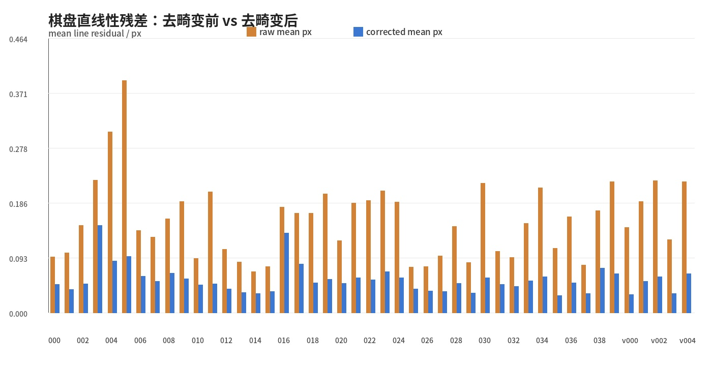
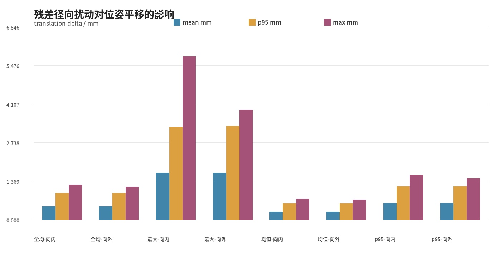
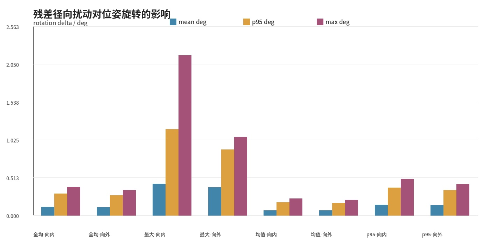
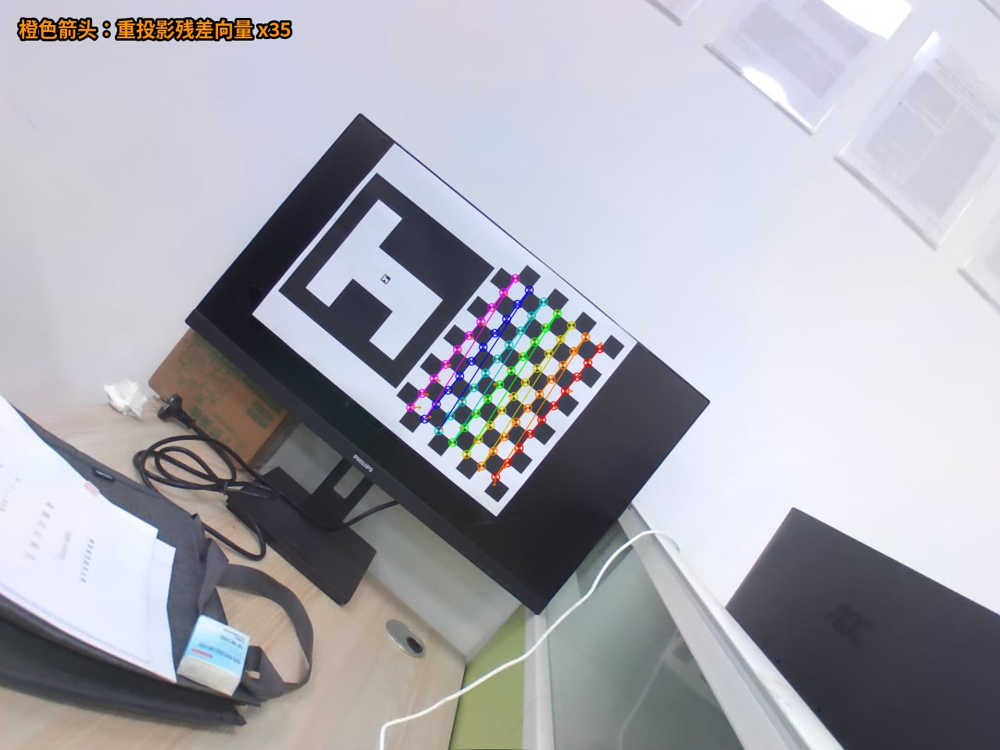

# 去畸变残差对位姿计算影响验证报告

## 技术结论

当前全局去畸变后，代表图像的棋盘直线性平均残差为 0.0348 px；在 70 个棋盘角点上把这一残差按径向方向进行保守扰动后，位姿平移变化均值为 0.2865 mm，最大值为 0.7190 mm。

即使采用代表图像的 p95 残差 0.0721 px 做同向径向扰动，双方向最坏平移变化为 1.5888 mm，双方向最坏旋转变化为 0.495107 deg。因此，当前残留的径向形变对棋盘格基准位姿的影响已经远小于角点检测、标定样本分布和靶标平面误差等主要误差源。

## 判断标准

不以“肉眼是否还像桶形”作为判断依据，而采用三个可量化标准：

1. 去畸变后的棋盘行列角点应更接近直线，直线性残差低于原图。
2. 将残留直线性残差按径向方向施加到角点后，重新 PnP 得到的位姿变化应显著小于当前实际重投影误差对应的量级。
3. 原图畸变模型直接求解与全局去畸变后求解应保持一致，说明去畸变表示没有引入明显额外位姿偏差。

## 数据和参数

- 图像数量：共 45 张，其中标定图 40 张，独立验证图 5 张。
- 棋盘格规格：10 x 7 内角点，格子边长 24.0 mm。
- 图像分辨率：1280 x 960。
- 畸变模型：pinhole_radial2，原始畸变系数 k1=-0.958851, k2=1.240927。
- 去畸变后使用的新内参矩阵：`[[1421.543446, 0.0, 628.133651], [0.0, 1421.543446, 442.413497], [0.0, 0.0, 1.0]]`。

## 计算公式

棋盘格第 `i` 个三维角点记为 `P_i=[X_i,Y_i,0]^T`，检测到的二维角点记为 `u_i=[x_i,y_i]^T`。相机位姿采用棋盘格坐标系到相机坐标系的变换：

```text
P_ci = R * P_i + t
u_hat_i = project(K, D, P_ci)
```

其中 `R` 由旋转向量 `rvec` 通过 Rodrigues 公式得到，`t` 为 `tvec_board_to_camera`，`K` 为内参矩阵，`D` 为畸变系数。全局去畸变后使用新内参 `K_new`，并令 `D_new=[0,0,0,0,0]`。

重投影残差用于衡量当前位姿是否能解释角点观测：

```text
e_i = ||u_i - u_hat_i||_2
e_mean = mean(e_i)
e_p95 = percentile_95(e_i)
e_max = max(e_i)
```

棋盘直线性残差用于衡量去畸变后棋盘格行列是否仍有弯曲。对每一行或每一列角点集合 `S`，用最小二乘直线拟合该行或列。设该直线经过均值点 `mu`，单位法向量为 `n`，则点到直线距离为：

```text
d_i = |(u_i - mu)^T n|
d_mean = mean(d_i)
d_p95 = percentile_95(d_i)
d_max = max(d_i)
```

报告中的 `0.0348 px` 指的是代表图像去畸变后所有行列点到各自拟合直线距离的平均值 `d_mean`，不是某一个角点的 PnP 重投影误差。

径向扰动实验用于估计残余弯曲如果继续以径向方式影响角点，会传递成多大的位姿变化。去畸变图像中的主点为 `c=[c_x,c_y]^T`，角点径向单位方向为：

```text
q_i = (u_i - c) / ||u_i - c||
u_i' = u_i + s * delta * q_i
```

其中 `delta` 取 `0.0348 px`、`0.0721 px` 等残差幅值，`s=+1` 表示向外扰动，`s=-1` 表示向内扰动。对扰动后的角点 `u_i'` 重新求解 PnP，得到 `R'` 和 `t'`。位姿变化用平移范数和旋转夹角表示：

```text
Delta_t = ||t' - t||_2
Delta_R = R' * R^T
Delta_theta = acos((trace(Delta_R)-1)/2)
```

`Delta_t` 的单位为 mm，`Delta_theta` 在报告中换算为 deg。

## 几何残差验证

45 张图的平均直线性残差从原图的 0.1567 px 降到去畸变后的 0.0566 px。代表图像 `calib_015` 的残差从 0.0782 px 降到 0.0348 px。



## 位姿扰动验证

为了估计残余径向畸变对位姿的影响，在去畸变后的角点上沿主点到角点的径向方向加入扰动。扰动幅值分别取代表图像的 mean、p95、max 残差，以及 40 张图整体的 mean 残差；每个幅值都同时测试向外和向内两个方向。扰动后的求解从原始位姿出发做 LM 局部精化，用于测量同一物理位姿附近的残差传递，而不是测平面位姿双解切换。

以 `0.0348 px` 这个代表图像 mean 残差为例，向外扰动得到的平均平移变化为 0.2865 mm，p95 为 0.5749 mm；平均旋转变化为 0.067734 deg。





## 原图模型与去畸变表示的一致性

同一批角点分别用原图畸变模型和全局去畸变图求解，平移差异均值为 0.0338 mm，p95 为 0.0970 mm；旋转差异均值为 0.032619 deg。这一步验证的是表示一致性，不把它当作绝对真值误差。



## 结论

当前去畸变后仍然可以测到非零残差，但它不是新的非零畸变系数，而是角点检测、插值重采样、标定模型近似和靶标平面误差共同留下的图像域残差。按照代表 mean 残差的径向扰动实验，这一级别残差传递到棋盘格位姿后是亚毫米量级、极小角度量级影响；因此，在当前棋盘格基准位姿计算中，它不是主要误差来源。

后续如果要继续压低位姿误差，优先方向不是把残差强行调成 0，而是提高标定数据覆盖、减少图像模糊、检查靶标平整度，并在 H 标志位姿算法中单独建立与棋盘格基准的对比实验。

## 实验文件

- 数值结果：`data/residual_pose_impact_experiment/residual_pose_impact.yaml`
- 可视化目录：`data/residual_pose_impact_experiment`
